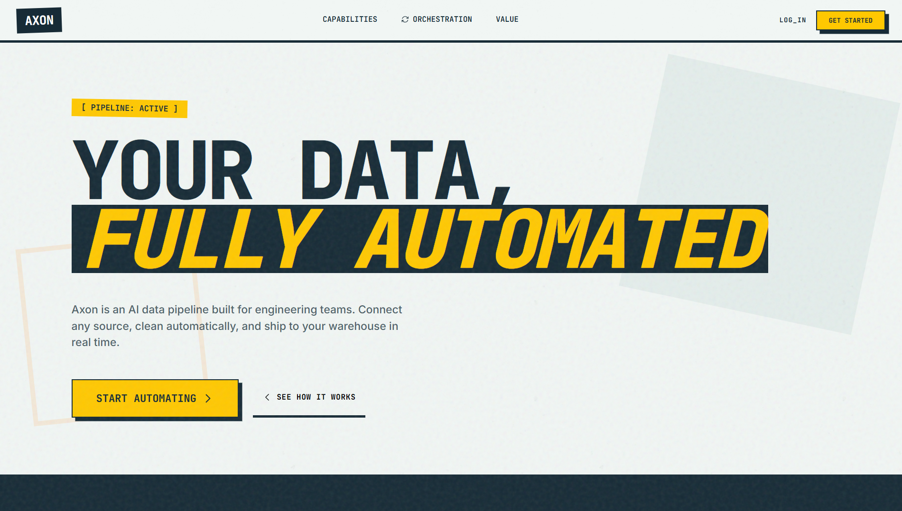
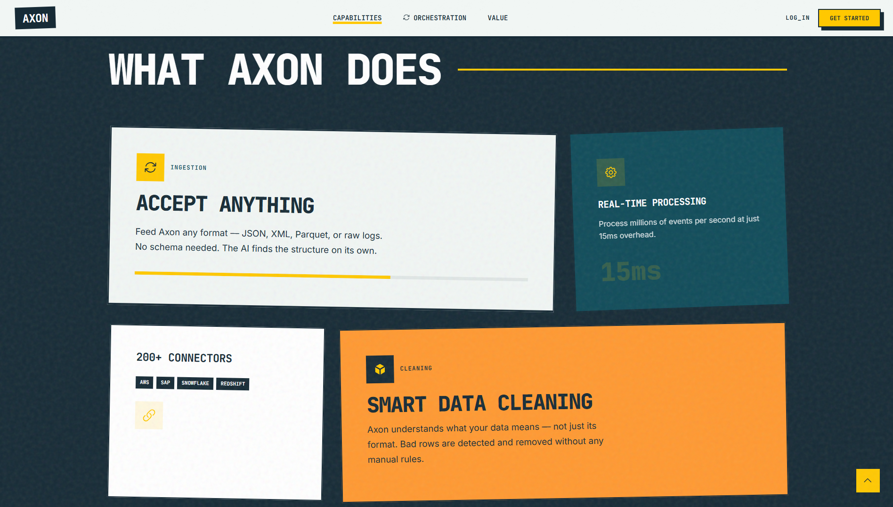
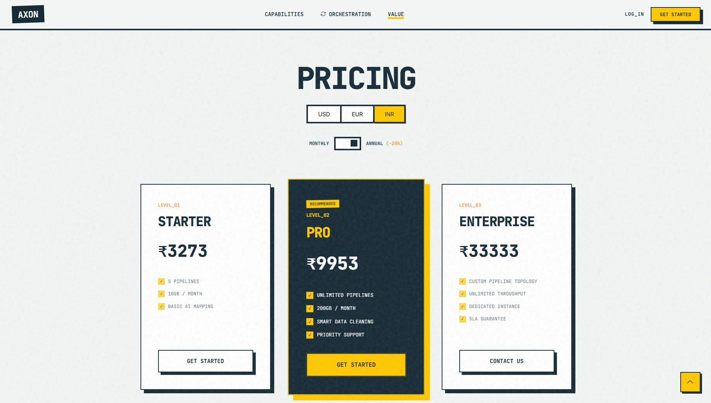
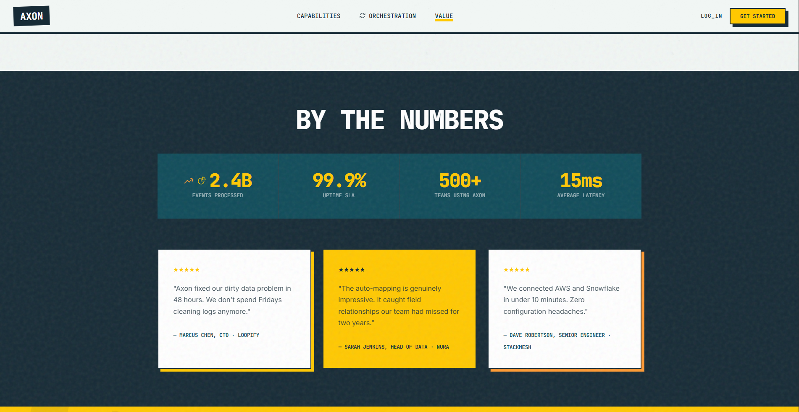
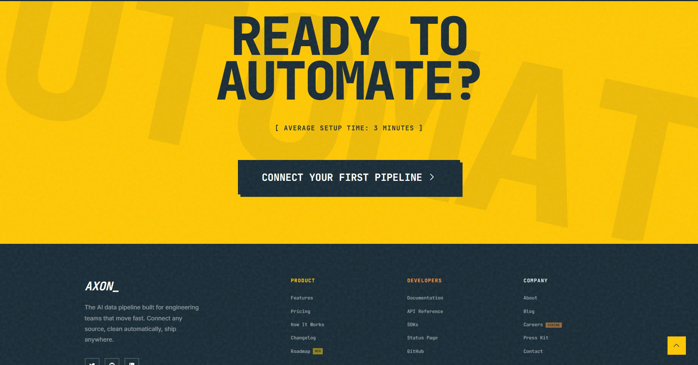

# AXON — AI-Driven Data Automation Platform

> **Frontend Battle · Phase 1 Submission** · Built in 4 hours under competition conditions



---

## Overview

**Axon** is a premium, high-converting, fully responsive SaaS landing page built for an AI-driven data automation platform. Submitted as part of **Frontend Battle Round 1 — Next-Gen AI Platform Speed Run**.

The build demonstrates architectural integrity, motion choreography, strict SEO hygiene, and performance-isolated state management — all delivered under a strict 4-hour countdown.

**Live Demo → [frontend-battle-axon.vercel.app](https://frontend-battle-axon.vercel.app)**

---

## Screenshots

| Section | Preview |
|---|---|
| Hero |  |
| Features Bento |  |
| Pricing |  |
| Social Proof |  |
| Footer |  |

---

## Features

### Feature 1 — Matrix-Driven Pricing & Currency Switcher
- Toggles between **Monthly** and **Annual** billing (flat 20% discount)
- Supports **3 currencies**: USD ($), EUR (€), INR (₹)
- Prices computed via a **multi-dimensional configuration matrix** — zero hardcoded UI values
- State updates are **strictly isolated to DOM text nodes** — no parent component re-renders, verified clean in Chrome DevTools Performance tab

### Feature 2 — Bento-to-Accordion with Context Lock
- Desktop: **12-column Bento Grid** with tilted brutalist cards
- Mobile: **touch-optimized Accordion list** — zero external UI libraries
- **Context Lock Constraint**: hovering a bento card on desktop tracks `activeIndex`; on browser resize past the 768px breakpoint, the exact active panel transfers to the Accordion state and animates open smoothly via double `requestAnimationFrame`
- Implemented with native CSS transitions only — no Framer Motion, no Radix, no HeadlessUI

---

## Tech Stack

| Layer | Choice |
|---|---|
| Framework | Vanilla JS (ES6+) |
| Styling | Custom CSS Variables |
| Animation | GSAP 3.12 + native CSS Transitions |
| Fonts | JetBrains Mono · Inter (Google Fonts) |
| Icons | Inline SVG + Iconify |
| Deployment | Vercel |

---

## Design System

### Color Palette

| Name | Hex | Usage |
|---|---|---|
| Forsythia | `#FFC801` | Primary accent, CTAs, highlights |
| Deep Saffron | `#FF9932` | Secondary accent, hover states |
| Nocturnal | `#114C5A` | Dark teal cards |
| Oceanic Noir | `#172B36` | Primary dark, backgrounds |
| Arctic Powder | `#F1F6F4` | Light background |
| Mystic Mint | `#D9E8E2` | Workflow section background |

### Typography

| Role | Font |
|---|---|
| Headings / Code / Labels | JetBrains Mono |
| Body / Descriptions | Inter |

---

## Page Structure

```
├── Header          Fixed nav with logo, links, LOG_IN, GET STARTED
├── Hero            Full-width headline, subtext, dual CTAs
├── Features        Bento Grid (desktop) / Accordion (mobile)
├── How It Works    3-step workflow with connected card layout
├── Pricing         Matrix-driven currency + billing switcher
├── By The Numbers  Stats grid + 3 testimonial cards
├── CTA             Full-width conversion section
└── Footer          4-column SaaS footer with status indicator
```

---

## Scoring Criteria Addressed

### Logic, Architecture & State Isolation (40 pts)
- ✅ Dynamic multi-currency pricing via `PRICING_MATRIX` config object
- ✅ Price updates target only `[data-price]` and `.price-symbol` text nodes
- ✅ No global re-renders on currency or billing toggle
- ✅ Bento → Accordion with `ResizeObserver` context transfer
- ✅ Zero banned libraries (no Framer Motion, Radix, Shadcn, HeadlessUI)

### SEO & Semantic HTML (30 pts)
- ✅ Full semantic structure: `<header>`, `<main>`, `<section>`, `<article>`, `<nav>`, `<footer>`
- ✅ `<h1>` → `<h2>` → `<h3>` hierarchy maintained throughout
- ✅ Complete Open Graph tags (`og:title`, `og:description`, `og:image`, `og:url`, `og:type`, `og:locale`, `og:site_name`)
- ✅ Twitter Card meta tags
- ✅ `robots`, `author`, `theme-color`, `canonical` meta tags
- ✅ All SVGs have `role="img"` and `aria-label`
- ✅ All interactive elements have `aria-label`
- ✅ GSAP animations do not block TTI — deferred after paint

### UI/UX & Motion (30 pts)
- ✅ Micro-interactions: 150ms–200ms `ease-out` on hovers and toggles
- ✅ Structural reflows: 300ms–400ms `ease-in-out` on accordion
- ✅ GSAP scroll-triggered card entrance animations
- ✅ Brutalist design with intentional card tilts (`rotate(1deg)`, `rotate(-2deg)`)
- ✅ Full breakpoint fluidity — mobile, tablet, desktop tested
- ✅ Mobile hamburger menu with slide-in transition and Escape key close
- ✅ Scroll-to-top button with visibility threshold

---

## Motion Spec

| Interaction | Duration | Easing |
|---|---|---|
| Nav hover underline | 150ms | ease-out |
| Button hover lift | 200ms | ease-out |
| Billing toggle dot | 200ms | ease-out |
| Currency button active | 150ms | ease-out |
| Accordion open/close | 300ms | ease-in-out |
| Mobile menu slide | 300ms | ease-in-out |
| Card scroll entrance | 800ms | power2.out (GSAP) |
| Hero headline | 1200ms | power4.out (GSAP) |

---

## Performance

- No render-blocking scripts in `<head>`
- GSAP loaded from CDN with `crossorigin="anonymous"`
- Fonts loaded via `<link rel="preconnect">` for faster DNS resolution
- `ResizeObserver` used instead of `window.resize` to avoid layout thrashing
- Scroll listener uses `{ passive: true }` flag
- No CSS-in-JS runtime — all styles are static CSS custom properties

---

## Local Development

```bash
# Clone the repo
git clone https://github.com/CanJayCode/frontend-battle.git

# Open in browser
# No build step required — pure Vanilla JS

# Recommended: use Live Server (VS Code extension)
# or any static file server
npx serve .
```

---

## Project Structure

```
frontend-battle/
├── index.html          # Single-file implementation
├── README.md           # This file
└── screenshots/        # Add your screenshots here
    ├── hero.png
    ├── features.png
    ├── pricing.png
    ├── social.png
    └── footer.png
```

---

## Disqualification Criteria — Verified Clear

| Criteria | Status |
|---|---|
| Public GitHub repository | ✅ |
| Live deployment (no 404/500) | ✅ |
| No plagiarism or boilerplate forks | ✅ |
| Actual feature source code present | ✅ |
| No banned libraries in dependencies | ✅ (Vanilla JS, no package.json) |
| No hardcoded pricing values | ✅ (Matrix-driven) |

---

## Built By

**CanJayCode** · Submitted for **Frontend Battle · Phase 1 · June 26, 2026**

> *"Built on raw concrete principles. Data is material. Architecture is everything."*
